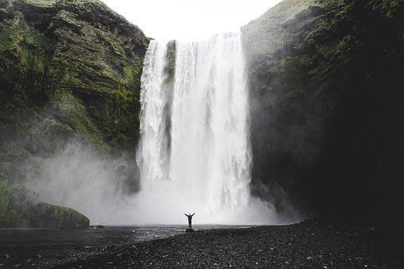

A waterfall is an area where water flows over a vertical drop or a series of steep drops in the course of a stream or river. Waterfalls also occur where meltwater drops over the edge of a tabular iceberg or ice shelf.

Waterfalls are commonly formed in the upper course of a river in steep mountains. Because of their landscape position, many waterfalls occur over bedrock fed by little contributing area, so may be ephemeral and flow only during rainstorms or significant snowmelt. The further downstream, the more perennial a waterfall can be. Waterfalls can have a wide range of widths and depths.

> Waterfalls also occur where meltwater drops over the edge of a tabular iceberg or ice shelf.

Often, the rock stratum just below the more resistant shelf will be of a softer type, meaning that undercutting due to splashback will occur here to form a shallow cave-like formation known as a rock shelter under and behind the waterfall. Eventually, the outcropping, more resistant cap rock will collapse under pressure to add blocks of rock to the base of the waterfall. These blocks of rock are then broken down into smaller boulders by attrition as they collide with each other, and they also erode the base of the waterfall by abrasion, creating a deep plunge pool in the gorge downstream.

A river sometimes flows over a large step in the rocks that may have been formed by a fault line. Waterfalls can occur along the edge of a glacial trough, where a stream or river flowing into a glacier continues to flow into a valley after the glacier has receded or melted. The large waterfalls in Yosemite Valley are examples of this phenomenon, which is referred to as a hanging valley. Another reason hanging valleys may form is where two rivers join and one is flowing faster than the other.

Waterfalls can be grouped into ten broad classes based on the average volume of water present on the fall (which depends on both the waterfall's average flow and its height) using a logarithmic scale. Class 10 waterfalls include Niagara Falls, Paulo Afonso Falls and Khone Falls.

[Wikipedia Waterfalls](https://en.wikipedia.org/wiki/Waterfall)
